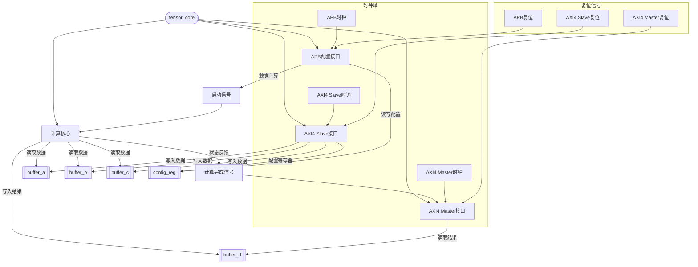

以下是基于Verilog代码的模块连接图描述，使用Mermaid语法表示：

### 关键说明：
1. **数据流**：
   - AXI4 Slave接口负责将外部数据写入`buffer_a`、`buffer_b`、`buffer_c`和`config_reg`。
   - APB接口通过读写`config_reg`配置参数，并触发`start_compute`信号启动计算。
   - 计算核心从缓冲区读取数据，计算结果写入`buffer_d`，并反馈`compute_done`信号。
   - AXI4 Master接口读取`buffer_d`数据并输出，依赖`compute_done`信号触发传输。

2. **控制信号**：
   - `start_compute`（APB→计算核心）和`compute_done`（计算核心→AXI4 Master）是关键控制链路。
   - AXI4 Slave和Master接口的时钟/复位独立，APB接口使用独立时钟域。

3. **模块依赖**：
   - `config_reg`是全局配置寄存器，被AXI4 Slave、APB和计算核心共享。
   - 所有缓冲区（`buffer_a`、`buffer_b`、`buffer_c`、`buffer_d`）通过顶层模块连接，实现数据隔离与同步。

此图清晰地展示了模块间的数据交互和控制逻辑，符合代码中定义的接口和功能划分。